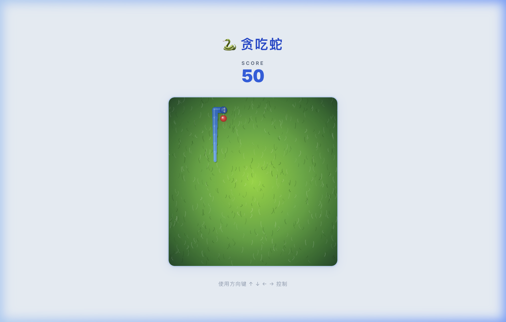

# Organic Snake 🐍

A modernized, high-performance web implementation of the classic Snake game, built with **React 19**, **Vite**, and **HTML5 Canvas**.

This project was developed using a **"Vibe Coding"** approach — leveraging advanced LLM prompting to generate highly optimized, decoupled, and visually polished rendering logic. It goes beyond the traditional block-based retro aesthetic by separating the underlying grid mechanics from the visual layer, resulting in smooth, continuous, and organic rendering.

---

## 🎬 Demo



<details>
<summary>📹 点击展开操作录屏</summary>


</details>

---

## 🚀 Core Technical Features

### Decoupled Architecture（逻辑与渲染解耦）

The core game mechanics (collision detection, movement, state management) run strictly on a mathematical $n \times n$ grid (`20 × 20`) to ensure precise and deterministic gameplay. The Canvas rendering layer is entirely independent of this grid, allowing for unrestricted visual freedom.

### Continuous Organic Rendering（有机平滑渲染）

Instead of rendering disjointed rectangular segments, the snake entity is drawn as a continuous, smooth path using HTML5 Canvas APIs. By leveraging `lineCap = 'round'`, `lineJoin = 'round'`, and dynamic directional vector calculations for the head (with two animated eyes tracking movement direction), the snake moves like a fluid, organic creature with a body that tapers from head to tail.

### Procedural Environment Generation（程序化环境生成）

The grass background is algorithmically generated using quadratic Bézier curves (`quadraticCurveTo`), creating a natural, non-repeating meadow texture with 600 procedural grass blades. A radial gradient provides natural lighting — bright spring green (`#8DE021`) at the center fading to deep forest green (`#1E5631`) at the edges, with a vignette overlay for depth.

### Off-screen Canvas Optimization（离屏渲染性能优化）

To maintain strict **60 FPS** performance, the complex procedural grass texture is pre-rendered **once** onto an off-screen canvas in memory (using a deterministic Mulberry32 PRNG for reproducibility). The main `requestAnimationFrame` render loop only executes a single `drawImage()` call for the background, preventing redundant computation and frame drops.

---

## 🤖 The "Vibe Coding" Strategy

This project serves as a case study in how to prompt AI effectively for complex graphics programming:

- **Declarative Constraints**: Forcing the AI to use specific APIs (e.g., "You MUST use off-screen canvas for the background")
- **State Clarity**: Explicitly separating the React UI state (Score, Game Over Overlay) from the Canvas game loop (`requestAnimationFrame`)
- **Iterative Refinement**: Starting from a basic grid-based snake, progressively refactoring through blue theme → organic rendering → procedural grass field, each as a focused prompt

---

## 🛠 Tech Stack

| Layer | Technology |
|-------|-----------|
| Framework | React 19 |
| Build Tool | Vite (Fast Refresh via `@vitejs/plugin-react`) |
| Graphics | HTML5 `<canvas>` API (2D Context) |
| Styling | Vanilla CSS (Flexbox, Google Fonts Inter) |
| Environment | Conda (`vibe_code_study`) + Node.js v22 |

---

## 📦 Getting Started

### Prerequisites

- **Node.js** v18+ (recommended: v22)
- Or use **Conda**: `conda create -n vibe_code_study nodejs -y`

### Installation

```bash
# Clone the repository
git clone https://github.com/Kevin11Kaikai/organic-snake.git
cd organic-snake

# Install dependencies
npm install

# Start the development server
npm run dev
```

Open your browser and navigate to **http://localhost:5173**.

### Controls

| Key | Action |
|-----|--------|
| `↑` `↓` `←` `→` | Control snake direction |
| Press any arrow key | Start the game |
| Click "重新开始" button | Restart after game over |

---

## 🧠 Project Structure

```
src/
├── components/              # React UI components
│   ├── GameBoard.jsx/css    # Canvas rendering engine (grass, snake, food)
│   ├── GameOver.jsx/css     # Game Over overlay with restart button
│   └── ScoreBoard.jsx/css   # Score display (HUD above canvas)
├── hooks/
│   └── useSnakeGame.js      # Core game logic hook (movement, collision, state)
├── utils/
│   └── constants.js         # Grid config, speed, color palette, direction map
├── App.jsx / App.css        # Root layout (centered Flexbox)
├── index.css                # Global styles (Inter font, blue-50 background)
└── main.jsx                 # React entry point
```

Key design decisions:
- **`useSnakeGame.js`** manages all game state via `useRef` (not `useState`) inside the game loop to avoid React re-render overhead
- **`GameBoard.jsx`** contains pure Canvas drawing functions (`drawSnake`, `drawFood`, `getGrassBackground`) decoupled from React lifecycle
- **`constants.js`** centralizes the blue color palette and grid dimensions for easy theming

---

## 📄 License

MIT License — see [LICENSE](LICENSE) for details.